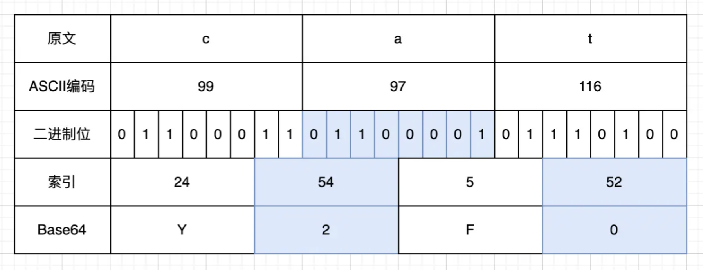

# Base64&Base32编码

## （1）Base64编码步骤



1. 找到原文中每一个字符在ascii编码表中对应的编码（查表）
	```js
	let str='Java';
	//例如：
	let char1 = "J";
	let char2 = "a";
	let char3 = "v";
	let char4 = "a";
	console.log(char1.charCodeAt());//=> 74
	console.log(char1.charCodeAt());//=> 97 
	console.log(char1.charCodeAt());//=> 118 
	console.log(char1.charCodeAt());//=> 74 
	```

	

2. 将上一步得到的code转为二进制的字符串8位（自己写，不够8位补零）
	```js
	
	'J'=>74   =>  01001010 
	'a'=>97   =>  01100001 
	'v'=>118  =>  01110110 
	'a'=>74   =>  01100001 
	```

3. 将上一步得到的8位二进制字符串，每6位一分隔，如果不够就在末尾补0
	```js
	 	01001010  01001010  01110110  01100001 
	==>
	    010010,100110,000101,110110,011000,010000
	```

	::question:如何将不够8位的二进制数补满8位？::earth_africa:**举个例子**

	> 二进制数`10101`  在`头部`补8个0 =>得到 `0000000010101`，接着通过字符串的slice方法`slice(-8)`
	>
	> 得到补齐8位后的二进制字符串`00010101`。

4. 自己生成一个`A-Za-z0-9+/`  范围内的字符串  ，如果不够8位补 `=`字符

	```js
	
	let base64='ABCDEFGHIJKLMNOPQRSTUVWXYZabcdefghijklmnopqrstuvwxyz0123456789+/'
	```
	
	base64编码完整代码如下：
	
	```js
	function base64(str) {
	  let arr = [];
	  let base64 =
	    "ABCDEFGHIJKLMNOPQRSTUVWXYZabcdefghijklmnopqrstuvwxyz0123456789+/";
	  let res = "";
	  for (let i = 0; i < str.length; i++) {
	    let binCode = str[i]
	      .charCodeAt()
	      .toString(2)
	      .replace(/^/, "00000000")
	      .slice(-8);
	    arr.push(binCode);
	  }
	  let binCodeStr = arr.join("");
	  let num = binCodeStr.length % 6;
	  let binCodeStrAddZero = binCodeStr + "0".repeat(6 - num);
	  let binCode6List = binCodeStrAddZero.match(/[01]{6}/g);
	  for (let j = 0; j < binCode6List.length; j++) {
	    //   2进制转10进制
	    let index = parseInt(binCode6List[j], 2);
	    res += base64[index];
	  }
	  res = res + "=".repeat(8 % res.length);
	  return res;
	}
	```

**==todo==完成Base64的解码过程！！！**

## （2）base64解码过程

以字符串`Java`为例，通过base64编码得到字符串`SmF2YQ==`。

**解码过程如下：**

+ ```js
	let str='SmF2YQ=='
	```

1. 去掉`str`中的所有`=`字符，得到 字符串 `SmF2YQ`

2. 将`str`转为数组，得到数组 `arr=['S','m','F','2','Y','Q']`

3. 找到`arr`各个元素在`base64`字符串中对应的索引，对数组中的元素重新赋值。
	```js
	indexArr=[ 18, 38, 5, 54, 24, 16 ]
	```

	

4. 将`indexArr`中的十进制索引转换为6位的二进制数据
	```js
	indexArr=[ '010010', '100110', '000101', '110110', '011000', '010000']
	```

5. 将数组`indexArr`中的各个6位的二进制数拼接成一个字符串`indexArrStr`，接着每8位一分割。这时可能会遇到`indexArrStr.length%8!==0`的情况，但是我们知道`indexArrStr.length%8`得到的数字就是我们在编码过程中补的`0`的个数，若`indexArrStr.length%8=num`，则`num`就是我们需要在` indexArr`末尾减去的`0`的个数。将`indexArr`减去末尾`num`个长度的字符并每8位一组进行分割后得到一个新数组`binCode8Arr`
	```js
	binCode8Arr=['01001010', '01100001', '01110110', '01100001']
	```

6. 将`binCode8Arr`中的二进制字符串转为10进制，再通过查找ASCII码表，找到其对应的字符，返回即可
	```js
	binCode8Arr=[74,97,118,74]
	```

7. 通过 `String.fromCharCode()`方法将Ascii码转为其代表的字符
	```js
	 binCode8Arr[k] = String.fromCharCode(temp);
	```

8. 最后通过字符串拼接或join()的方法返回解码后的结果

## （3）Base32编解码

原理：同`Base64编解码`相同，只是在编解码过程中使用字符串`base32`而已，同时在分割的时候`5`位一组进行分割。

```js
  let base32 = "ABCDEFGHIJKLMNOPQRSTUVWXYZ234567";
```

> Base32编码

```js
/**
 *  10进制数转为8位2进制数的方法
 * @param {num/string} num
 * @returns {string}
 */
function decTo8Bin(num) {
}
// console.log(decToBin(19));

/**
 *
 * @param {string} str 被编码的字符串
 * @param {string} res  编码后的字符串
 */
function base32(str) {
  let arr = [];
  let base32 = "ABCDEFGHIJKLMNOPQRSTUVWXYZ234567";
  let res = "";
  for (let i = 0; i < str.length; i++) {
    //  将字符转位ASCII码
    let item = str[i].charCodeAt();
    //  将对应ASCII码的转为8位的2进制数
    let binCode = decTo8Bin(item);
    arr.push(binCode);
  }
  let binCodeStr = arr.join("");
  let num = binCodeStr.length % 5;
  // 长度不能被5整除就在末尾补0
  let binCodeStrAddZero = binCodeStr + "0".repeat(5 - num);
  // 5个二进制数为一组，分割
  let binCode6List = binCodeStrAddZero.match(/[01]{5}/g);
  for (let j = 0; j < binCode6List.length; j++) {
    //    5位的二进制数转成10进制
    let index = parseInt(binCode6List[j], 2);
    //   在字符串中找到对应的字符并连接
    res += base32[index];
  }
  res += "=".repeat(8 - (res.length % 8));
  return res;
}
console.log(base32("Java"));
// =>JJQXMYI=
```

>Base32解码

```js
function decodeBase32(str) {
  let base32 = "ABCDEFGHIJKLMNOPQRSTUVWXYZ234567";
  let res = "";
  let arr = str.replace(/=+/g, "").split("");
  for (let i = 0; i < arr.length; i++) {
    let tempNum = base32.indexOf(arr[i]).toString(2);
    // 转成5位的二进制数
    arr[i] = tempNum.replace(/^/, "00000").slice(-5);
  }
  let binCode5Str = arr.join("");
  console.log(binCode5Str.length);
  let delNum = binCode5Str.length % 8;
  let binCode8Str = binCode5Str.slice(0, binCode5Str.length - delNum);
  let binCode8Arr = binCode8Str.match(/[01]{8}/g);
  for (let k = 0; k < binCode8Arr.length; k++) {
    let temp = parseInt(binCode8Arr[k], 2);
    binCode8Arr[k] = String.fromCharCode(temp);
    res += binCode8Arr[k];
  }
  return res;
}

console.log(decodeBase32("JJQXMYI="));
// => 'Java'
```


